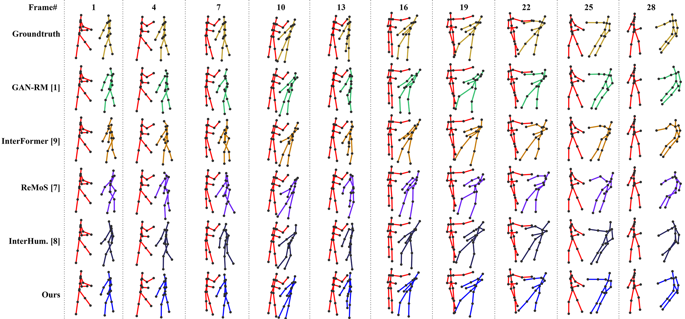
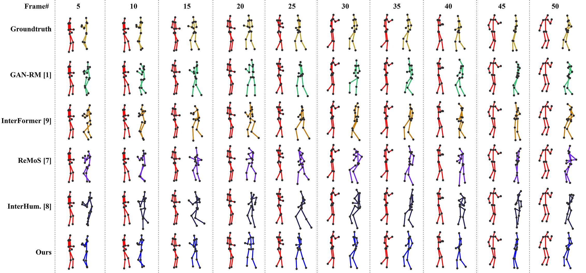
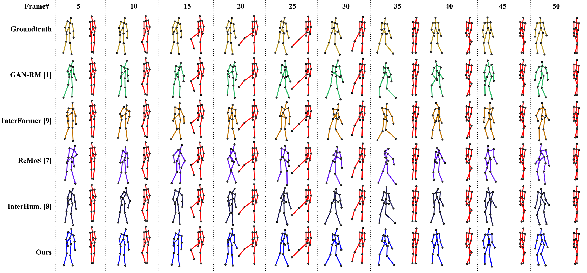

# From Action to Reaction: Human Reaction Motion Synthesis using Latent Space Regularization and Alignment with Intermediate Motion Semantics

We propose a novel dual-encoder conditional variational auto encoder network (DE-CVAE). DE-CVAE comprises two encoders to learn the action and reaction motion spaces separately, with a decoder generating the reaction-motion sequence.

## Our model

## Quantized Motion Tokens (QMTs)

## Results on SBU Dataset

## Results on DuetDance Dataset

## Results on K3HI Dataset

## Authors
Ali Asghar Manjotho
Tekie Tsegay Tewolde
Zhendong Niu

## Training

## Testing

## References
Thanks to:
InterFormer
GAN Reactive Motion

